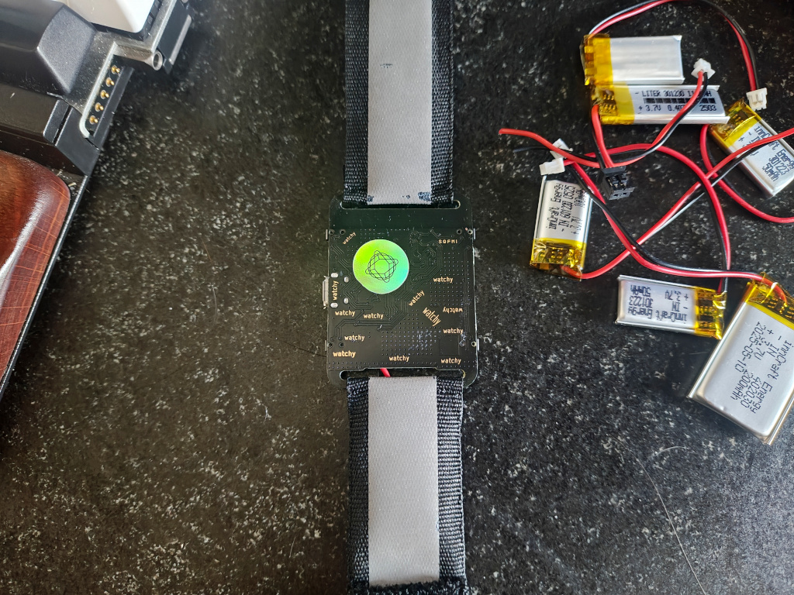
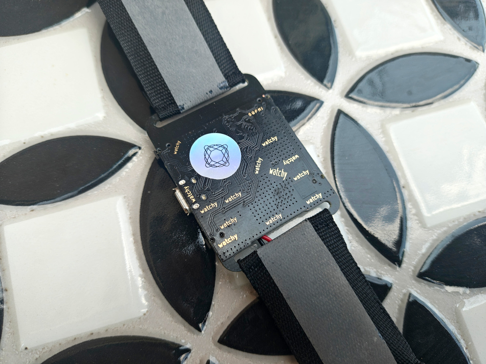
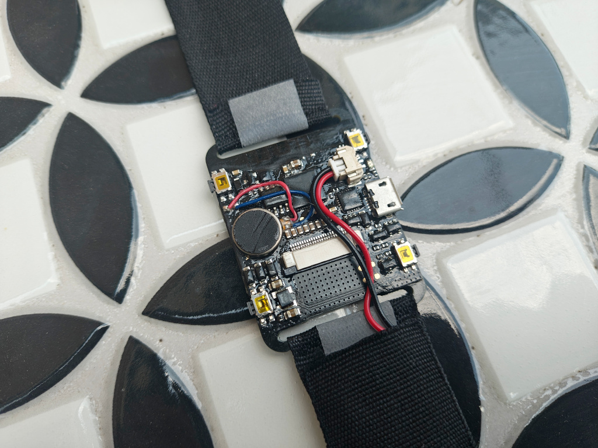

# HeadlessWatchy

HeadlessWatchy is a ROM for [Watchy by SQFMI](https://watchy.sqfmi.com/) that makes it usable without the e-paper display. Useful if you dropped yours on a concrete.

## Status

This is a fork of [CatchyWatchy](https://github.com/mafik/CatchyWatchy). The original is probably better for you if your Watchy still has a screen.

It was developed for personal use and some settings were hardcoded during its development. The timezone, WiFi SSID & password are hardcoded as C constants. You will have to edit the sources & rebuild it in order to personalize it. The recommended way to do this is to use clone this repo & open it with VSCode with PlatformIO extension installed. AI assistants also work very well.

The Bluetooth button requires the bundled Android companion app. When it's opened, it makes the companion app on the smartphone call a predefined Tasker task.

Features:

* Bluetooth triggering of Tasker task on a phone
* WiFi time synchronization on startup
* Current time (hour and minutes) vibrated in morse code on button press
* Current hour vibrated in morse code every hour
* Timer with buttons for +1 and +5 minutes

Pull requests are welcome!

## Usage

Main Screen:

* Upper Left Button => Vibrate current time in morse code
* Upper Right Button => Unused
* Lower Left Button => Trigger Tasker task over bluetooth
* Lower Right Button => Start 1-minute countdown

Timer:

* Upper Left Button => Vibrate current time in morse code
* Upper Right Button => Add 5 minutes to the countdown
* Lower Left Button => Go to Main Screen
* Lower Right Button => Add 1 minute to the countdown

## Art

The art used in this watch face is based on:

* Android app icon - KadaburaDraws on Twitter: https://twitter.com/KadaburaDraws
